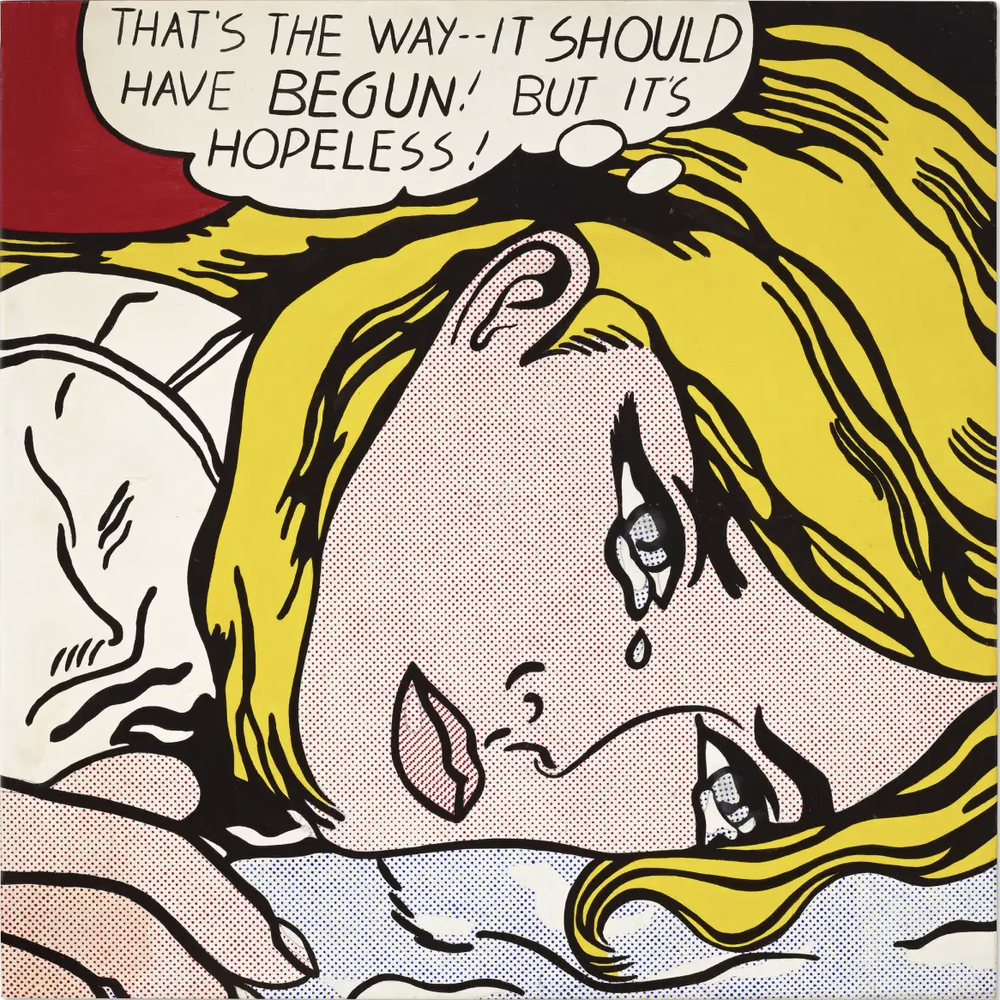
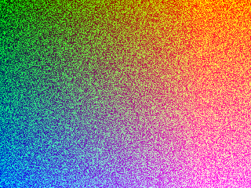

# Quiz8 IDEA9103 Yuxiao Lian

## Part 1: Imaging Technique Inspiration

I've always been fascinated by *Pop Art*, where artists use radical and innovative means to create their works. I was most inspired by **Andy warhol**'s photographic silkscreen print technique and **Roy Lichtenstein**'s Benday dot paintings. Their use of constrating colours, repetitive lines and dots, and the interplay of bright and shadow create impressive and dynamic works. Incorporating these techniques into our assignment can **enhance the animation's texture**, as well as **add movements and depths** of the original artwork, making it more **visually interactive and engaging**.

> _Andy Warhol, Marilyn Diptych, 1962, acrylic on canvas, 2054 x 1448 mm (Tate)_

> _Roy Lichtenstein, Hopeless, 1963, oil and acrylic paint on canvas, 1118 x 1118 mm (Kunstmuseum Basel)_

## Part 2: Coding Technique Exploration

The **Pixel Array** and **Weighted Voronoi Stipplin**g can replicate the visual effects discussed earlier. Through the Pixel Array, by accessing each pixel of the canvas, we are allowed to manipulate their range of colours and movement to create denamic effects and high contrast colour presence that mimic Warhol's silkscreen print effects with more playfulness. And Weighted Voronoi Stippling enables us to render Benday dot style by creating spots and colour blocks, based on the distribution of light and dark colours in the image.

> See fullcode:[_Code example by Daniel Shiffman, Weighted Voronoi Stippling_](https://editor.p5js.org/codingtrain/sketches/_HTZUBPld)

> See fullcode:[_Code example by Daniel Shiffman, Pixel Array_](https://editor.p5js.org/codingtrain/sketches/A92PDk-1z)